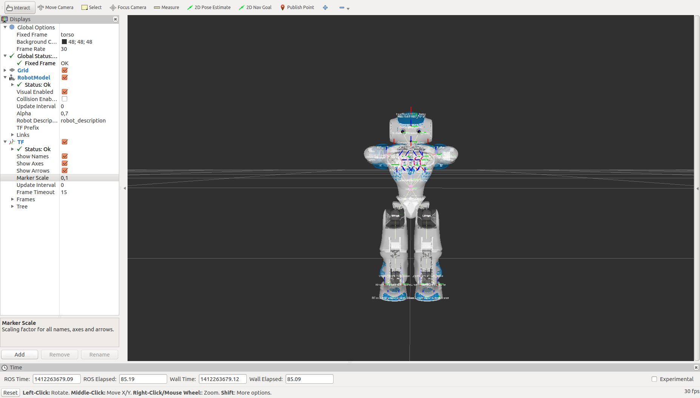
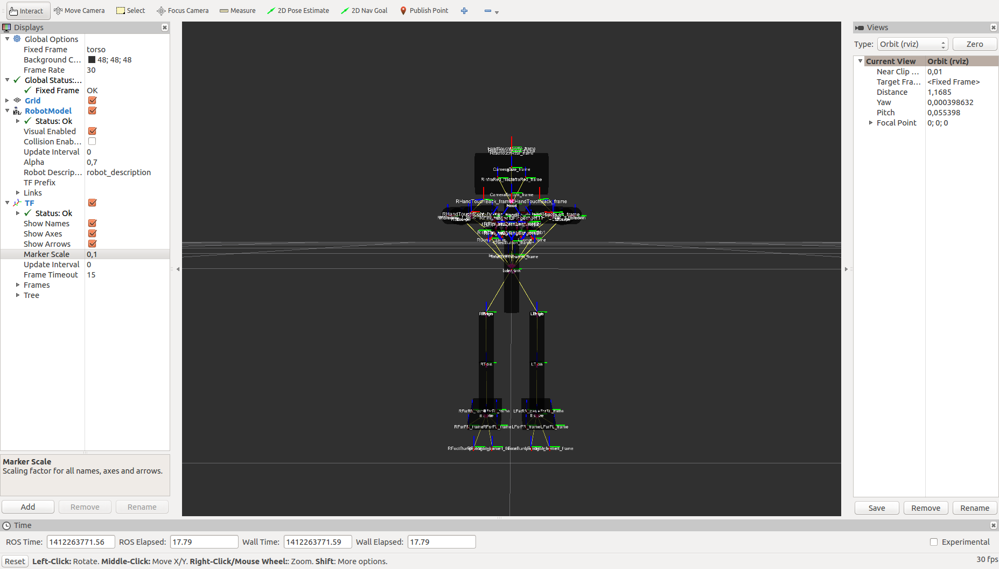
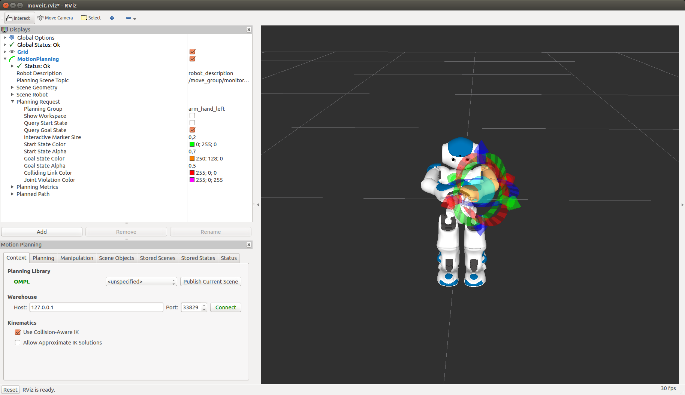
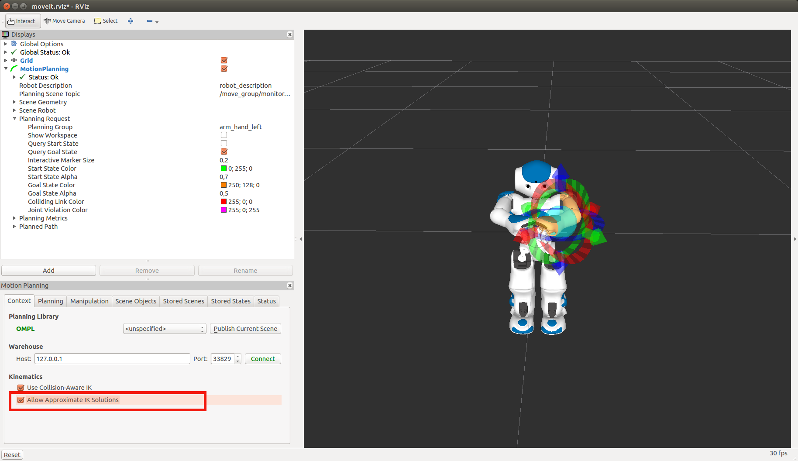
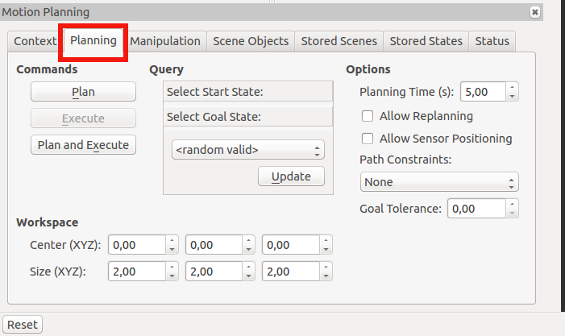
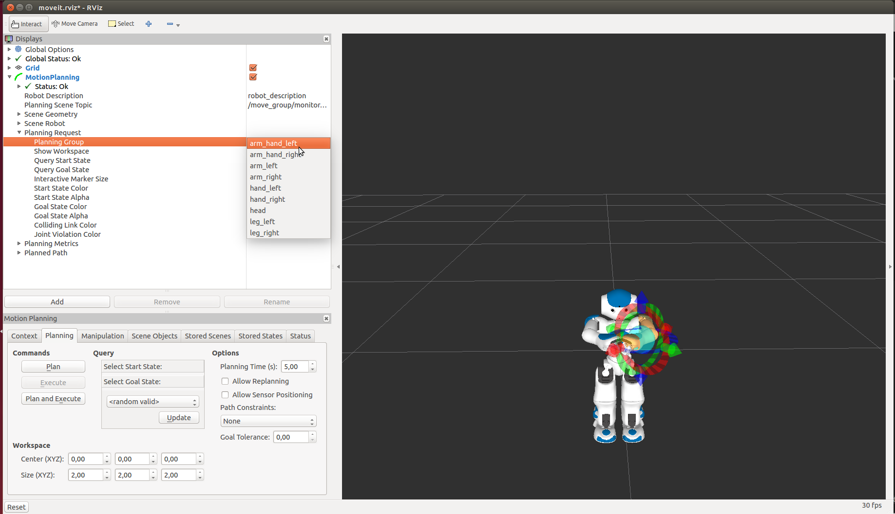
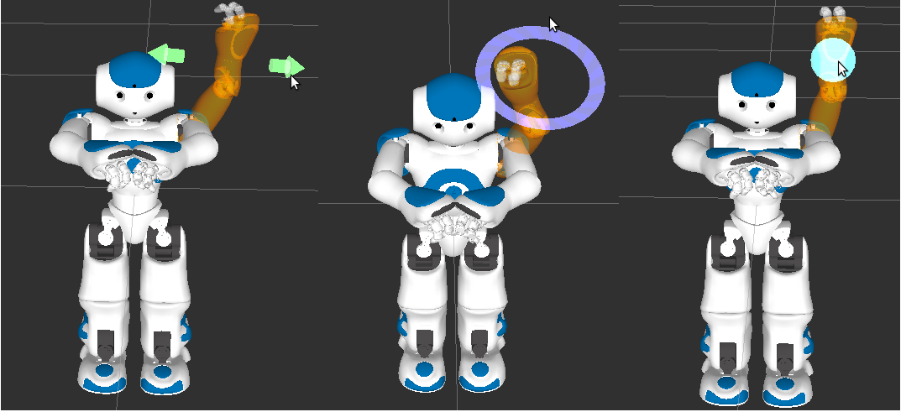
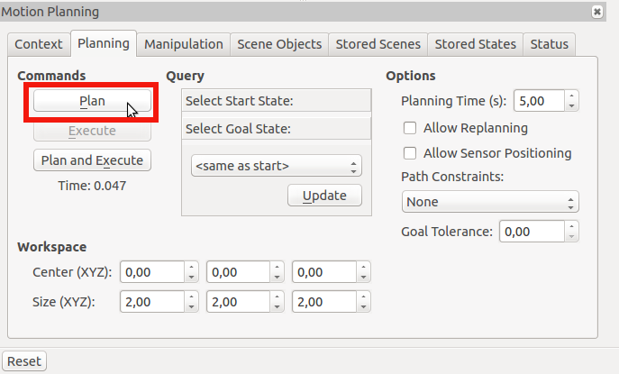
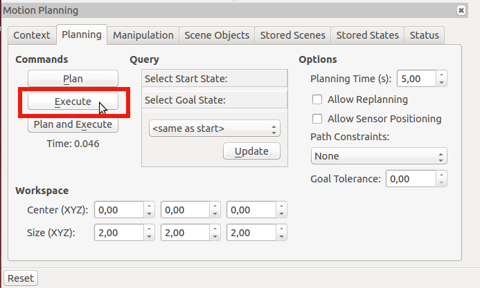
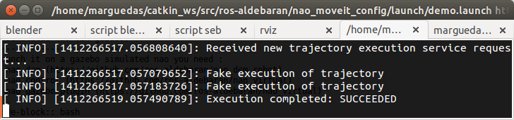

nao_moveit_config: Tutorial
==========================

This tutorial introduce how to use moveit to plan and execute trajectories on aldebaran's NAO robots.

Requirements
============
It's highly recommended to have the following packages installed on your system before running nao_moveit_config:

To simulate nao on moveit only:
* nao_description : explicit dependency

.. code-block:: bash

	sudo apt-get install ros-indigo-nao-description

or clone the repo in your workspace

.. code-block:: bash

	git clone git@github.com:ros-nao/nao_robot.git
	cd ..
	catkin_make

* nao_meshes : you need this package to properly display the robot in RVIZ

.. code-block:: bash

	sudo apt-get install ros-indigo-nao-meshes

Note : you need to accept the license in the terminal for the package to be installed

You can easily check if the meshes have been successfully installed by running : 

.. code-block:: bash

	roslaunch nao_description display_generated.launch

If the meshes are installed you should see : 

Otherwise either you have a lot of error messages and RVIZ doesn't display anything, either you have the following image

Launch Moveit Rviz plugin
=======================

Without robot
-------------
You can run this moveit package either unconnected to any robot or attached to a robot (real or simulated):
For a standalone execution :

.. code-block:: bash

    roslaunch nao_moveit_config demo.launch

On a real nao
--------------
To launch it on a real nao you need:
   - nao_dcm (https://github.com/ros-aldebaran/nao_dcm_robot)
   - nao_control (https://github.com/ros-aldebaran/nao_virtual)

First set NAO_IP environment variable to your robot PI address

Modify the bringup configuration file : nao_dcm_bringup/config/nao_dcm.yaml 

Set the rosparam "RobotIP" to your Nao's IP address

.. code-block:: bash

    roslaunch nao_dcm_bringup nao_dcm_H25_bringup_remote.launch
    
Wait until nao_dcm_bringup is ready then run:

.. code-block:: bash

    roslaunch nao_moveit_config moveit_planner.launch

On a simulated nao (in gazebo)
-----------------------------
To launch it on a gazebo simulated nao you need : 
   - nao_dcm (https://github.com/ros-aldebaran/nao_dcm_robot)
   - nao_control (https://github.com/ros-aldebaran/nao_virtual)
   - nao_gazebo_plugin (https://github.com/ros-aldebaran/nao_virtual)

.. code-block:: bash

    roslaunch nao_dcm_gazebo nao_dcm_gazebo_H25.launch
    
Wait until nao_gazebo is ready then click on the play button in gazebo.

Finally run:

.. code-block:: bash

    roslaunch nao_moveit_config moveit_planner.launch

This is based on the work of Konstantinos Chatzilygeroudis: https://github.com/costashatz/nao_dcm.

Use Moveit
==========
All the following screenshots have been done by launching demo.launch. Everything should be the same for the other use cases, except the position of the robot at launchtime.

First check the box "Allow approximate IK Solutions" on the bottom of the left column.

Go to the planning tab

You can chose the part of the robot you want to move by setting the planning group

Move your robot by drag and dropping the interactive markers.
- translate the end-effector by moving the arrows
- rotate the end effector by moving along the circles
- move the group by moving the blue sphere

To compute the trajectory you click on the Plan button

Once the motion is satisfying you can try it on your real robot using 'execute' which is enabled only after a successful planning

In the terminal you can see the status of the trajectory execution. In my case everything is ok

Now you noww everything to play with nao_moveit_config
